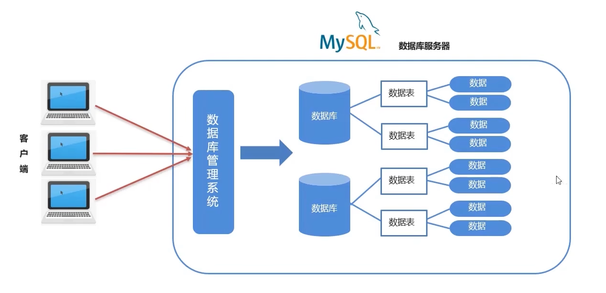

## 一、数据库相关概念

### 1.1 数据库

```
1.数据库即存储数据的仓库，数据是有组织的存储
2.英文：DataBase,简称：DB
```

### 1.2 数据库软件

```
1.数据库软件即管理数据库的软件
2.英文：DataBase Management System,简称：DBMS
```

### 1.3 SQL

```
1.英文：Structured Query Langeage,简称：SQL,结构化查询语言
2.操作关系型数据库的编程语言
3.定义操作所有关系型数据库的统一标准
```

## 二、常见的关系型数据库管理系统

```
MySQL: 开源免费的中小型数据库
Oracel: 收费的大型数据库
SQL Server: MicroSoft公司收费的的中型数据库
DB2: IBM公司的大型收费数据库
MariaDB: 开源免费的中小型数据库
PostgreSQL: 开源免费的中小型数据库
SQLite: 嵌入式的微型数据库,如作为Android内置数据库
……
```

## 三、MySQL数据库

### 3.1 安装MySQL

```
在Centos7中,通过Docker安装MySQL(8.0.27),注：目前学习阶段未对mysql的数据目录做数据卷的处理，删除容器后数据也会消失，因此删除容器前注意备份数据。

安装步骤如下:
```

1. **拉取镜像**

```bash
docker pull mysql:8.0.27
```
2. **运行镜像，产生容器**
```bash
docker run -d -p 3306:3306 -e MYSQL_ROOT_PASSWORD=root --name=mysql mysql
```

### 3.2 设置Root账户可远程访问数据库

在 MySQL 8.0 中，要设置 `root` 用户可以从远程主机访问，你需要执行几个步骤。以下是如何实现的步骤：

1. **登录MySQL**

首先，你需要以 `root` 用户身份登录到 MySQL 服务器。这通常是在服务器上本地完成的。


```bash
mysql -u root -p
```
输入密码后，你将进入 MySQL 提示符。

2. **创建远程 root 用户**（如果还没有的话）

默认情况下，MySQL 的 `root` 用户可能只允许从 `localhost` 访问。要允许从任何主机访问，你需要为该用户指定一个 '%' 通配符，但这并不安全。建议只允许来自特定主机的连接。但如果你只是想测试或临时允许从任何主机访问，可以这样做：


```sql
CREATE USER 'root'@'%' IDENTIFIED BY 'YOUR_PASSWORD';
GRANT ALL PRIVILEGES ON *.* TO 'root'@'%' WITH GRANT OPTION;
```
注意：`YOUR_PASSWORD` 需要替换为你的密码。出于安全考虑，强烈建议仅为受信任的主机创建用户，而不是使用 '%'。

3. **刷新权限**

为了让新的权限设置立即生效，你需要刷新 MySQL 的权限表：


```sql
FLUSH PRIVILEGES;
```
4. **开放3306端口**


```bash
firewall-cmd --zone=publish --add-port=3306/tcp --permanent
firewall-cmd --reload
```
5. **测试远程连接**

从远程主机使用 MySQL 客户端工具（如 `mysql` 命令行工具或任何图形界面工具）尝试连接到 MySQL 服务器。确保使用正确的 IP 地址、端口和凭据。


```bash
mysql -h YOUR_SERVER_IP -u root -p
```
输入你在步骤 2 中设置的密码。

**注意**：允许从远程主机访问 MySQL 的 `root` 用户可能会带来安全风险。确保你了解这些风险，并仅在必要时采取此操作。在生产环境中，通常建议创建具有适当权限的专用用户来管理远程连接。

### 3.3 卸载MySQL

```
通过Docker安装的MySQL,卸载十分的方便,卸载MySQL即删除对应的容器，注：目前学习阶段未对mysql的数据目录做数据卷的处理，删除容器后数据也会消失，因此删除容器前注意备份数据。
```

**删除容器的命令**

```bash
docker rm 容器Id
```

### 3.4 MySQL的数据模型

**关系型数据库**

```
关系型数据库即通过多张能够相互连接的二维表来存储数据的数据库
```

**数据模型**



```
一个MySQL数据库管理系统中可以创建多个数据库,一个数据库中可以创建多张数据表,一个表中可以存放多条数据。

数据库：文件夹的方式存在
数据表：以fmf结尾的文件
数据：以MY0结尾的文件
```

## 四、SQL

通过SQL，来告诉数据库管理系统做什么操作。
根据MySQL的数据模型可以看出,需要`通过SQL来操作数据库、数据表、以及数据表中的数据`。操作的类型分为：`增、删、改、查`

